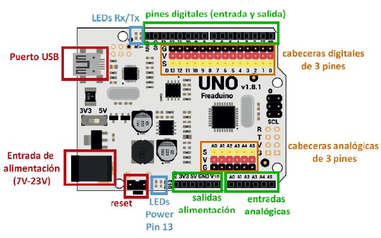
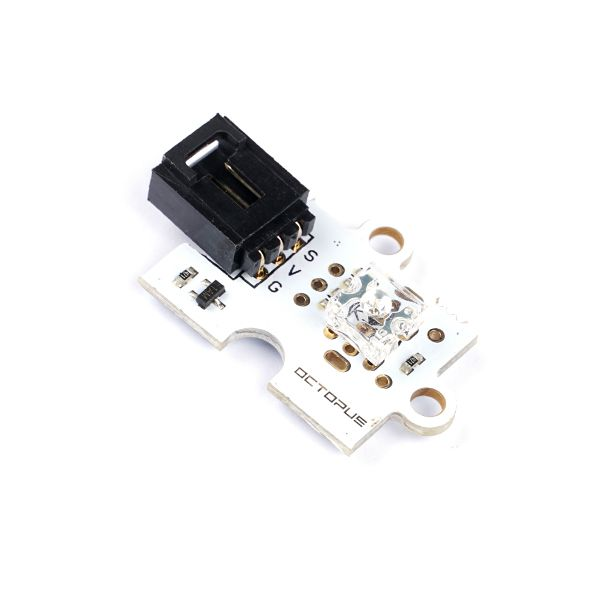
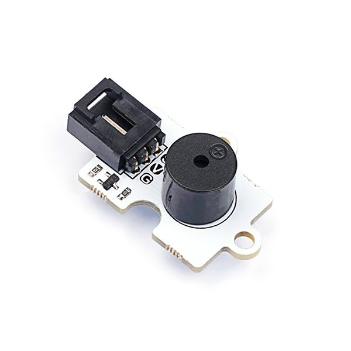
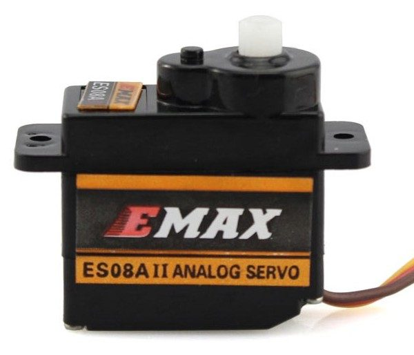

# Curso de Arduino

## 1. Arduino y sistema basados en hardware y software libre

Arduino es uno de los tipos de las placas más populares del mundo maker, pero que a diferencia de la Raspberry Pi no cuenta con un único modelo, sino que ofrece unas bases de hardware abierto para que otros fabricantes puedan crear sus propias placas.

El proyecto **nació en 2003**, cuando varios estudiantes del Instituto de Diseño Interactivo de Ivrea, Italia, con el fin de facilitar el acceso y uso de la electrónico y programación. Lo hicieron para que los estudiantes de electrónica tuviesen una alternativa más económica a las populares BASIC Stamp, unas placas que por aquel entonces valían más de cien dólares, y que no todos se podían permitir.

El resultado fue Arduino, una placa con todos los elementos necesarios para conectar periféricos a las entradas y salidas de un microcontrolador, y que puede ser programada tanto en Windows como macOS y GNU/Linux. Un proyecto que promueve la filosofía 'learning by doing', que viene a querer decir que la mejor manera de aprender es cacharreando.

Arduino es una plataforma de creación de electrónica de **código abierto**, la cual está basada en **hardware y software libre**, flexible y fácil de utilizar para los creadores y desarrolladores. Esta plataforma permite crear diferentes tipos de microordenadores de una sola placa a los que la comunidad de creadores puede darles diferentes tipos de uso.

Para poder entender este concepto, primero vas a tener que entender los conceptos de hardware libre y el software libre. **El hardware** libre son los dispositivos cuyas especificaciones y diagramas son de acceso público, de manera que cualquiera puede replicarlos. Esto quiere decir que Arduino ofrece las bases para que cualquier otra persona o empresa pueda crear sus propias placas, pudiendo ser diferentes entre ellas pero igualmente funcionales al partir de la misma base.

**El software libre** son los programas informáticos cuyo código es accesible por cualquiera para que quien quiera pueda utilizarlo y modificarlo. Arduino ofrece la plataforma Arduino IDE (Entorno de Desarrollo Integrado), que es un entorno de programación con el que cualquiera puede crear aplicaciones para las placas Arduino, de manera que se les puede dar todo tipo de utilidades.

### Cómo funciona Arduino

El Arduino es una placa basada en un microcontrolador ATMEL. Los microcontroladores son circuitos integrados en los que se pueden grabar instrucciones, las cuales las escribes con el lenguaje de programación que puedes utilizar en el entorno Arduino IDE. Estas instrucciones permiten crear programas que interactúan con los circuitos de la placa.

El microcontrolador de Arduino posee lo que se llama una interfaz de entrada, que es una conexión en la que podemos conectar en la placa diferentes tipos de periféricos. La información de estos periféricos que conectes se trasladará al microcontrolador, el cual se encargará de procesar los datos que le lleguen a través de ellos.

El tipo de periféricos que puedas utilizar para enviar datos al microcontrolador depende en gran medida de qué uso le estés pensando dar. Pueden ser cámaras para obtener imágenes, teclados para introducir datos, o diferentes tipos de sensores.

También cuenta con una interfaz de salida, que es la que se encarga de llevar la información que se ha procesado en el Arduino a otros periféricos. Estos periféricos pueden ser pantallas o altavoces en los que reproducir los datos procesados, pero también pueden ser otras placas o controladores.

Arduino es un proyecto y no un modelo concreto de placa, lo que quiere decir que compartiendo su diseño básico te puedes encontrar con diferentes tipos de placas. Las hay de varias formas, tamaños y colores para a las necesidades del proyecto en el que estés trabajando, las hay sencillas o con características mejoradas, Arduinos orientados al Internet de las Cosas o la impresión 3D y, por supuesto, dependiendo de estas características te encontrarás con todo tipo de precios.

Además, las placas Arduino también cuentan con otro tipo de componentes llamados Escudos (Shields) o mochilas. Se trata de una especie de placas que se conectan a la placa principal para añadirle una infinidad de funciones, como GPS, relojes en tiempo real, conectividad por radio, pantallas táctiles LCD, placas de desarrollo, y un larguísimo etcétera de elementos. Incluso hay [tiendas](https://www.cetronic.es/sqlcommerce/disenos/plantilla1/seccion/Catalogo.jsp?gclid=CjwKEAjwxruuBRC9lLGslqjs-HISJAAkq21srnMhxnzsJIWwQYBfY91AuEwALyhaKK0Ud4-FeBxkixoC96Xw_wcB&idIdioma=&cPath=1342&idTienda=93) con secciones especializadas en dichos elementos.

### Proyectos

La enorme flexibilidad y el carácter libre y abierto de Arduino hacen que puedas utilizar este tipo de placas prácticamente para cualquier cosa, desde relojes hasta básculas conectadas, pasando por robots, persianas controladas por voz o tu propia vending machine . En [este artículo](https://www.xataka.com/makers/46-proyectos-makers-para-hacer-verano-arduino-raspberry-pi) tienes varias decenas de ejemplos.

### Freaduino



## 2. Entorno de programación y configuración

El lenguaje de programación de Arduino está basado en C++ y aunque la referencia para el lenguaje de programación de Arduino la podemos encontrar [aquí](https://www.arduino.cc/reference/en/), también es posible usar comandos estandar de C++ en la programación de Arduino.


### 2.1 Instalación

Debemos acceder a la página de de descarga de Software para la instalación de [Arduino](https://www.arduino.cc/en/Main/Software). Desde aquí decargaremos la versión que sea adecuada para nuestro sistema operativo.

Una vez instalado, en nuestro programa y con la placa conectada verificaremos que en el apartado de Herramientas/Tools, la placa/board seleccionada es "Arduino Uno" y el puerto/port es el correcto.

#### Posibles problemas

**Ubuntu**. Si tenemos problemas a la hora de compilar y subir a nuestra placa el codigo generado por temas de permisos: `sudo chmod a+rw /dev/ttyACM0`.

### 2.2 Elementos básicos en la programación en C++

Cualquier duda sobre un comando, función, etc… debemos consultar en la referencia de Arduino. [Referencia](https://www.programarya.com/Cursos/C++)


#### **{} entre llaves**
Las llaves sirven para definir el principio y el final de un bloque de instrucciones. Se utilizan para los bloques de programación setup(), loop(), if.., etc.

Una llave de apertura “{“ siempre debe ir seguida de una llave de cierre “}”, si no es así el compilador dará errores. El entorno de programación de Arduino incluye una herramienta de gran utilidad para comprobar el total de llaves. Sólo tienes que hacer click en el punto de inserción de una llave abierta e inmediatamente se marca el correspondiente cierre de ese bloque (llave cerrada).

#### **; punto y coma**

El punto y coma “;” se utiliza para separar instrucciones en el lenguaje de programación de Arduino. También se utiliza para separar elementos en una instrucción de tipo “bucle for”.

Nota: Si olvidáis poner fin a una línea con un punto y coma se producirá en un error de compilación.

#### **/*… */ bloque de comentarios**

Los bloques de comentarios, o comentarios multi-línea son áreas de texto ignorados por el programa que se utilizan para las descripciones del código o comentarios que ayudan a comprender el programa. Comienzan con / * y terminan con * / y pueden abarcar varias líneas.

Debido a que los comentarios son ignorados por el compilador y no ocupan espacio en la memoria de Arduino pueden ser utilizados con generosidad.

#### **// línea de comentarios**

Una línea de comentario empieza con / / y terminan con la siguiente línea de código. Al igual que los comentarios de bloque, los de línea son ignoradas por el programa y no ocupan espacio en la memoria.

Una línea de comentario se utiliza a menudo después de una instrucción, para proporcionar más información acerca de lo que hace esta o para recordarla más adelante.

#### **Variables**

Una variable es un espacio en la memoria, en el cual el programador asigna un valor determinado por el tipo de dato que el lenguaje de programación va soportar, para declararla es necesario saber que tipo de dato la contiene. Los siguientes son los tipos de datos esenciales:

  - **int**: es numérico sirve para números enteros sin punto decimal  (1,2,3,4.. )
  - **float**: es numérico y sirve para números con parte fraccionaria, es decir con punto decimal ( 1.2, 1.3, 1.4, ….)
  - **char**: es de tipo carácter y cadena de caracteres, es decir que puedes asignar desde una letra, símbolo o numero hasta una palabra o serie de caracteres ( a, 2, !, &, hola, etc.)
  - **bool**: es de tipo verdadero o falso, este tipo de dato mostrara en pantalla un “1” en caso de ser true o “0” en caso de ser false.

#### **Operadores**

Un operador es un elemento de programa que se aplica a uno o varios  operandos en una expresión o instrucción

**Operadores de asignación.** Tal y como su nombre lo indica, este tipo de operadores permiten la asignación de un valor especifico a una variable.

| Operador |       Acción      | Ejemplo | Resultado |
|:--------:|:-----------------:|:-------:|:---------:|
|     =    | Asignación básica |  x = 6  |  x vale 6 |
|    *=    |  Asigna producto  |  x *= 5 | x vale 30 |
|    /=    |  Asigna división  |  x /= 2 |  x vale 3 |
|    +=    |    Asigna suma    |  x += 4 | x vale 10 |
|    -=    |    Asigna resta   |  x -= 2 |  x vale 4 |
|    %=    |   Asigna modulo   |  x %= 2 |  x vale 0 |

**Operadores aritméticos.** Los operadores aritméticos se usan para  realizar cálculos y operaciones con números reales.

| Operador |     Acción     |   Ejemplo  | Resultado |
|:--------:|:--------------:|:----------:|:---------:|
|     -    |      Resta     |  x = 5 - 3 |  x vale 2 |
|     +    |      Suma      |  x = 5 + 3 |  x vale 8 |
|     *    | Multiplicación |  x = 2 * 3 |  x vale 6 |
|     /    |    División    |  x = 6 / 3 |  x vale 2 |
|     %    |     Módulo     |  x = 5 % 2 |  x vale 1 |
|    --    |   Decremento   | x = 1; x-- |  x vale 0 |
|    ++    |   Incremento   | x = 1; x++ |  x vale 2 |

**Operadores relacionales.** Denominados operadores binarios lógicos y de comparación, se utilizan para comprobar la veracidad o falsedad de determinadas propuestas de relación (en realidad se trata respuestas a preguntas). Las expresiones que los contienen se denominan expresiones relacionales. Aceptan diversos tipos de argumentos, y el resultado, que es la respuesta a la pregunta, es siempre del tipo cierto/falso, es decir, producen un resultado booleano.

| Operador |     Acción    |   Ejemplo  |   Resultado  |
|:--------:|:-------------:|:----------:|:------------:|
|     <    |     Menor     |  x = 5 < 3 | x vale false |
|     >    |     Mayor     |  x = 5 > 3 |  x vale true |
|    <=    | Menor o igual | x = 6 <= 3 | x vale false |
|    >=    | Mayor o igual | x = 6 >= 3 |  x vale true |
|    ==    |     Igual     | x = 5 == 2 | x vale false |
|    !=    |   Diferente   | x = 5 != 2 |  x vale true |

**Operadores lógicos.** Los operadores lógicos producen un resultado booleano, y sus operandos son también valores lógicos.

| Operador |      Acción     |  Ejemplo |                       Resultado                      |
|:--------:|:---------------:|:--------:|:----------------------------------------------------:|
|    &&    |    AND lógico   |  A && B  | Si ambos son verdaderos  se obtiene verdadero (true) |
|   \|\|   |    OR lógico    | A \|\| B |           Verdadero si alguno es verdadero           |
|     !    | Negación lógica |    !A    |                     Negación de A                    |

#### **Condicionales**

Un condicional, permite establecer una serie de condiciones al interior de nuestro programa, que nos ayudan a determinar que acciones llevará cabo dadas ciertas circunstancias. Los condicionales aumentan la "expresividad" de un software, es decir nos permiten considerar diferentes situaciones con antelación, evitando o permitiendo sortear diferentes tipos de situaciones que son del interés de nuestra aplicación.

**if-else**. Los condicionales if-else, son una estructura de control, que nos permiten tomar cierta decisión al interior de nuestro algoritmo, es decir, nos permiten determinar que acciones tomar dada o no cierta condición,

```c++
if(condición a evaluar) //Por ejemplo 50 <= 10
{
        ....
        ....
    Bloque de Instrucciones si se cumple la condición....
        ....
        ....
}
else
{
        ....
        ....
    Bloque de Instrucciones si NO se cumple la condición....
        ....
        ....
}
```

**Switch**. Los condicionales Switch, son una estructura de control condicional, que permite definir múltiples casos que puede llegar a cumplir una variable cualquiera, y qué acción tomar en cualquiera de estas situaciones, incluso es posible determinar qué acción llevar a cabo en caso de no cumplir ninguna de las condiciones dadas.

```c++
switch(opción) //donde opción es la variable a comparar
{
    case valor1: //Bloque de instrucciones 1;
    break;
    case valor2: //Bloque de instrucciones 2;
    break;
    case valor3: //Bloque de instrucciones 3;
    break;
    //Nótese que valor 1 2 y 3 son los valores que puede tomar la opción
    //la instrucción break es necesaria, para no ejecutar todos los casos.
    default: //Bloque de instrucciones por defecto;
    //default, es el bloque que se ejecuta en caso de que no se de ningún caso
}
```

#### **Bucles**

Un ciclo o bucle permite repetir una o varias instrucciones cuantas veces lo necesitemos. Existen diferentes tipos de ciclos o bucles, cada uno tiene una utilidad para casos específicos y depende de nuestra habilidad y conocimientos poder determinar en qué momento es bueno usar alguno de ellos.

**Ciclo For**. Los ciclos for son lo que se conoce como estructuras de control de flujo cíclicas o simplemente estructuras cíclicas, estos ciclos, como su nombre lo sugiere, nos permiten ejecutar una o varias líneas de código de forma iterativa, conociendo un valor especifico inicial y otro valor final, además nos permiten determinar el tamaño del paso entre cada "giro" o iteración del ciclo. En esta línea está prácticamente todo lo esencial de un ciclo for. La sintaxis es simple, tenemos una variable de control llamada i que es tipo entero (int), cabe notar que la variable se puede llamar como nosotros lo deseemos y puede ser del tipo de queramos también, sin embargo en la mayoría de los casos se usa la "i" como nombre y el entero como tipo, pero somos libres de modificar esto a nuestro gusto. Esta variable "i" se le asigna un valor inicial que puede ser cualquier número correspondiente al tipo de dato asignado. Posteriormente lo que haremos será especificar hasta donde irá nuestro ciclo por medio del valor final, ten en cuenta que cada uno de estos componentes es separado por un punto y coma ";", también es importante saber que la condición final puede ser cualquier cosa, mayor, menor, mayor o igual, menor o igual, sin embargo no tiene sentido que la condición sea por ejemplo un igual, pues nuestra variable de control siempre va a cambiar entre valores, menores o mayores que el valor final deseado, si fuera un igual no tendríamos un error de sintaxis, pero nuestro for básicamente no haría nada de nada. Finalmente el ultimo componente es el tamaño del paso, este componente se especifica aumentando en la cantidad deseada la variable de control.

```c++
for(int i = valor inicial; i <= valor final; i = i + paso)
{
        ....
        ....
    Bloque de Instrucciones....
        ....
        ....
}
```

**Ciclo While**.Los ciclos while son también una estructura cíclica, que nos permite ejecutar una o varias líneas de código de manera repetitiva sin necesidad de tener un valor inicial e incluso a veces sin siquiera conocer cuando se va a dar el valor final que esperamos, los ciclos while, no dependen directamente de valores numéricos, sino de valores booleanos, es decir su ejecución depende del valor de verdad de una condición dada, verdadera o falso, nada más.

```c++
while(condición de bucle) //por ejemplo i <= 100
{
        ....
        ....
    Bloque de Instrucciones....
        ....
        ....
}
```

**Ciclo Do-While**.Los ciclos do-while son una estructura de control cíclica, los cuales nos permiten ejecutar una o varias líneas de código de forma repetitiva sin necesidad de tener un valor inicial e incluso a veces sin siquiera conocer cuando se va a dar el valor final, hasta aquí son similares a los ciclos while, sin embargo el ciclo do-while nos permite añadir cierta ventaja adicional y esta consiste que nos da la posibilidad de ejecutar primero el bloque de instrucciones antes de evaluar la condición necesaria, de este modo los ciclos do-while, son más efectivos para algunas situaciones especificas.

```c++
do
{
        ....
        ....
    Bloque de Instrucciones....
        ....
        ....
}
while(condición de bucle); //por ejemplo numero <= 23
```

#### **Funciones**

Las funciones son una herramienta indispensable para el programador, tanto las funciones creadas por él mismo como las que le son proporcionadas por otras librerías, cualquiera que sea el caso, las funciones permiten automatizar tareas repetitivas, encapsular el código que utilizamos, e incluso mejorar la seguridad, confiabilidad y estabilidad de nuestros programas.

```c++
tipo nombreFuncion([tipo nombreArgumento,[tipo nombreArgumento]...])
{
    /*
        * Bloque de instrucciones
    */

    return valor;
}
```

### 2.3 Peculiaridades de Arduino

Arduino como introduciamos, cuenta ademas con un juego de funciones extra para manipular sus entradas y salidas. [Documentación](https://www.arduino.cc/reference/en/). Algunas de estas funciones vamos a ir viendolas conforme introduzcamos los sensores con los que trabajaremos.

#### **setup()**

La función [`setup()`](https://www.arduino.cc/reference/en/language/structure/sketch/setup/) se llama cuando el programa comienza. Se utiliza para inicializar variables, el estado de los pines, inicializar librerias, etc. Solo se llamará una vez, después de cada enchufado o reseteo de la placa Arduino.

#### **loop()**

Después de ejecutar la función [`setup()`](https://www.arduino.cc/reference/en/language/structure/sketch/setup/), que inicializa y establece los valores iniciales, la funcion [`loop()`](https://www.arduino.cc/reference/en/language/structure/sketch/loop/) realiza un bucle infinito permitiendo a nuestro programa cambiar su estado y responder. Se utiliza para cambiar activamente el control de la placa Arduino.

#### **Constantes**

En Arduino contamos con ciertas [constantes propias](https://www.arduino.cc/reference/en/language/variables/constants/constants/) para poder manipular los diferentes sensores:

   - INPUT: Utilizado en la configuración de un pin para indicar que es de entrada, por lo que podremos leer valores del dispositivo conectado a él. Por ejemplo un boton.
   - OUTPUT: Mediante esta constante indicamos que un pin es de salida y por lo tanto las señales mandadas serán diferentes. Por ejemplo un zumbador.
   
Para conocer el estado de un pin de entrada utilizaremos *HIGH* y *LOW*, donde nos darán información de si el dispositivo se esta 'utilizando' o no, respectivamente.

#### **pinMode(pin, mode)**

Con [`pinMode(pin, mode)`](https://www.arduino.cc/reference/en/language/functions/digital-io/pinmode/) configuraremos un pin especificado como de entrada o salida.

#### **delay(ms)**

El método [`delay(ms)`](https://www.arduino.cc/reference/en/language/functions/time/delay/) pausa el programa durante un tiempo especificado como parametro en milisegundos. 

#### **Serial**

La comunicación [`Serial`](https://www.arduino.cc/reference/en/language/functions/communication/serial/) nos permite mantener un dialogo entre la placa Arduino y nuestro ordenador u otros dispositivos.

Para hacer uso de esta comunicación es necesario definir un velocidad de bits por segundo con la que nuestro dispositivo capturará los mensajes de Arduino, esto se hace mediante [`Serial.begin(speed)`](https://www.arduino.cc/reference/en/language/functions/communication/serial/begin/), donde un valor típico para nuestra placa es 9600. Por otra parte, para que la placa mande un mensaje al puerto serial donde esta conectado utilizaremos [`Serial.println(val)`](https://www.arduino.cc/reference/en/language/functions/communication/serial/println/), que recibe como parámetro el valor del mensaje que queremos comunicar.

Dentro del IDE de Arduino podemos abrir el monitor Serial desde Herramientas/Tools > Serial Monitor (Ctrl+Shift+M).

## 3. Sensores digitales. Entradas y salidas digitales.

### Piraña LED (salida)

Podemos encontrarlo [aquí](https://www.elecfreaks.com/octopus-piranha-led-brick-obpiranha-green.html). Se trata de un modulo LED que nos permite emitir luz.



Los LEDs son dispositivos de salida a los que deberemos asignarles un valor, encendido (HIGH) o apagado (LOW), esto lo haremos mediante la función [`digitalWrite(pin, mode)`](https://www.arduino.cc/reference/en/language/functions/digital-io/digitalwrite/). Podemos encontrar un ejemplo de funcionamiento [aquí](programas/basico/piranha_led/piranha_led.ino).

### Boton (entrada)

Podemos encontrarlo [aquí](https://www.elecfreaks.com/octopus-digital-pushbutton-brick-obpushbutton-blue.html). Un boton nos sirve como desencadenante de acciones. Para trabajar con estos utilizaremos las funciones [`digitalRead`](https://www.arduino.cc/reference/en/language/functions/digital-io/digitalread/) que nos permite leer el valor de entrada de un pin especifico y asi comprobaremos si el estado de dicho pin es `HIGH`o `LOW`, es decir, si esta presionado o no, respectivamente.


Un [ejemplo](https://create.arduino.cc/projecthub/muhammad-aqib/arduino-button-tutorial-using-arduino-digitalread-function-08adb5) donde detectamos la pulsación del boton podemos encontrarlo [aquí](programas/basico/boton/boton.ino).


### Zumbador pasivo (salida)

Podemos encontrarlo [aquí](https://www.elecfreaks.com/octopus-passive-buzzer-brick-obpb01.html). El zumbador podemos encontrarlo en sistemas de alarmas, ordenadores, temporizadores y otros dispositivos. Para trabajar con estos utilizaremos las funciones [`tone()`](https://www.arduino.cc/reference/en/language/functions/advanced-io/tone/) y [`noTone()`](https://www.arduino.cc/reference/en/language/functions/advanced-io/notone/) que nos permitiran reproducir sonido y pararlo, respectivamente.



Un [ejemplo](https://create.arduino.cc/projecthub/SURYATEJA/use-a-buzzer-module-piezo-speaker-using-arduino-uno-89df45) sencillo en el que reproducimos sonido en un zumbador conectado en el pin 9 de nuestra placa podemos encontrarlo [aqui](programas/basico/zumbador_pasivo/zumbador_pasivo.ino).

### HC-SR04 (salida)

Podemos encontrarlo [aquí](https://tienda.bricogeek.com/sensores-distancia/741-sensor-de-distancia-por-ultrasonidos-hc-sr04.html).Dentro del mundo Arduino, el emisor/receptor de ultrasonidos HC-SR04 es quizás uno de los complementos más reconocibles. Este sensor se emplea en todo tipo de proyectos, siendo su principal uso el de reconocer obstáculos, aunque debido su buena resolución, también se emplea para medir la distancias a objetos.


*Como funciona*. El principio en el que se basa su funcionamiento es muy sencillo, tan solo hay que generar una onda sónica en el emisor mediante un pulso en la patilla que pone "trig" (trigger o disparador), esta onda al encontrarse con algún obstáculo rebotará, volviendo al sensor y siendo registrada por el receptor, traduciéndose esta en un pulso en la patilla "Echo". Con esto podemos hacer dos cosas, detectar un obstáculo esperando simplemente que Arduino reciba un "Echo" o contar el tiempo que transcurre desde que se manda el pulso por el trigger hasta que se recibe, de esta forma, y conociendo cual es la velocidad del sonido, podemos determinar de forma muy sencilla la distancia exacta a la que se encuentra el objeto en el que esta rebotando la señal.

Para aclarar un poco el factor de multiplicación que vamos a introducir en Arduino, basta con decir que la velocidad es igual al espacio dividido por el tiempo que se tarda en recorrer dicho espacio. La velocidad del sonido es conocida (343m/s) y el tiempo lo vamos a determinar, como el tiempo que transcurre desde que efectuamos el disparo hasta que recibimos el eco.

[Aquí](programas/basico/hc_sr04/hc_sr04.ino) tenemos un ejemplo de uso de este sensor para medir distancias.

## 4. Sensores analógicos. Entradas y salidas analógicas.

### Fotocelula (entrada)

Podemos encontrarla [aquí](https://www.elecfreaks.com/octopus-analog-photocell-brick-obphotocell.html). Las fotocelulas son sensores que nos permiten detectar luz. Son pequeñas, baratas, y se pueden utilizar de forma sencilla. Básicamente son un resistor que cambiasn su valor resistivo dependiendo de cuanta luz reciben.


Un [ejemplo](https://create.arduino.cc/projecthub/55546/innovation-lab-7-photocell-led-on-off-3df0ab) sencillo en el que leeremos el valor de la fotocelula y lo imprimiremos en el monitor Serial podemos encontrarlo [aqui](programas/basico/fotocelula/fotocelula.ino). Recordad que los valores de la fotocelula que leeremos son análogicos y por ello además deberemos conectarlos a los puertos analogicos (los que empiezan por A).

### Servo Motor (especial)

Podemos encontrarlo [aquí](https://mkelectronica.com/producto/mini-servo-motor-emax-es08a/). Un servomotor es un dispositivo similar a un motor de corriente continua que tiene la capacidad de ubicarse en cualquier posición dentro de su rango de operación, y mantenerse estable en dicha posición.



Podemos comprobar cuidadosamente de forma manual cual es el rango de movimiento del servo. En este caso son 120 grados. Finalmente, podemos ver un ejemplo de uso donde recorremos todo el rango de movimiento del servo [aquí](programas/basico/servo/servo.ino).

## 5. Comunicaciones electrónica-sensores. Comunicación serie, bluetooth

## 6. Comunicación electrónica-sensores. Comunicación wifi ESP8266.
https://www.luisllamas.es/arduino-wifi-esp8266-esp01/